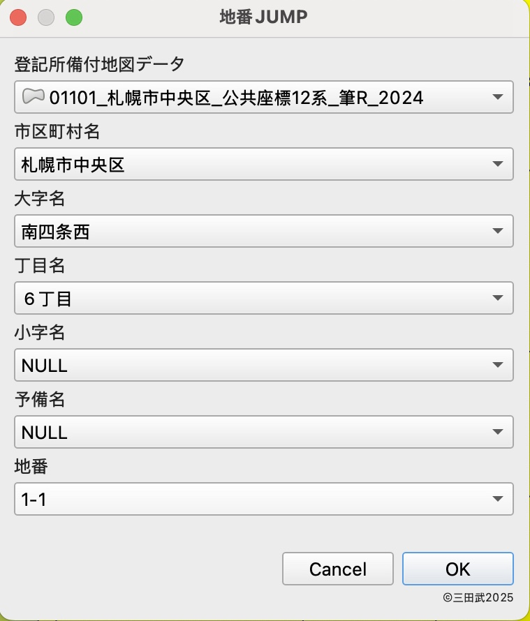
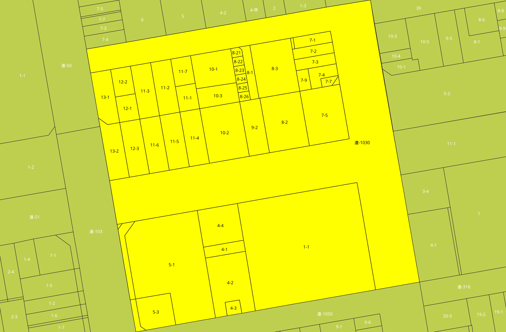

# 地番ジャンプ　地番JUMP Chiban-JUMP
This plugin searches for the parcel number and displays it in the center of the map canvas. 
Ｇ空間情報センターで公開されている「[登記所備付地図の電子データ](https://front.geospatial.jp/moj-chizu-xml-readme/moj-chizu-shp-download/)」で、指定した地番を検索・表示するためのQGISプラグインです。

## 検索方法
 
検索するレイヤ、大字名、地番などを選択します。空白のままであれば全ての地物を検索します。
## 検索結果
 
検索した地物が画面中央に表示されます。
